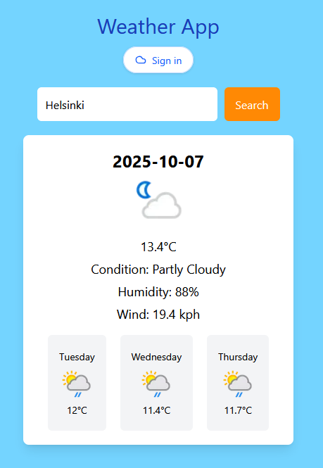

# 🌤️ Weather App – City Weather Lookup

## Overview
A clean and intuitive weather application that allows users to check current weather conditions and the next two days’ forecast for any city worldwide. Features Google OAuth2 authentication and is powered by the WeatherAPI service.

## 🌐 Live Demo
**[View Live Site](https://weather-app-next-rosy.vercel.app)** ⭐ Try it out without any setup!

## ✨ Key Features
- 🔍 **City search** to get real-time weather data and a 2-day forecast for any location
- ☁️ **Current weather conditions** including temperature, humidity, and forecasts
- 🔐 **Google OAuth 2.0 login** for personalized experience (displays username)
- 📱 **Responsive interface** built with Tailwind CSS
- ⚡ **Fast performance** with Next.js optimization

## 🔧 Tech Stack
**Frontend:** React • TypeScript • Next.js • Tailwind CSS  
**State Management:** Redux Toolkit
**API:** WeatherAPI  
**Authentication:** OAuth 2.0 (Google) • NextAuth.js  
**Testing:** Jest  

## 📖 How It Works
1. **Enter a city name** in the search bar
2. **View current weather** including temperature, conditions, humidity, and more
3. **Sign in with Google** to personalize your experience (optional)
4. **Check multiple cities** by searching for different locations

## 🎯 Development Highlights
- **API integration** with WeatherAPI for real-time weather data
- **OAuth 2.0 authentication** using NextAuth.js and Google provider
- **TypeScript** for type-safe development
- **Redux state management** for predictable data flow
- **Responsive design** with Tailwind CSS utility classes
- **Next.js optimization** for fast page loads and SEO